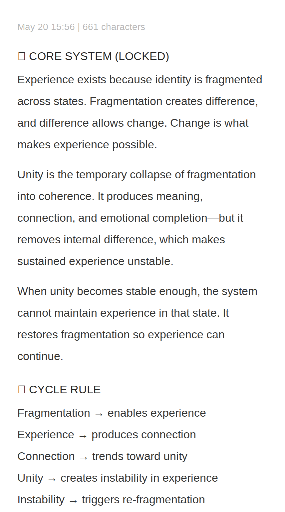

# Case Study — The First Note

## Purpose

This page records the origin point of the narrative design work shown in this portfolio.

On May 20, 2026, I wrote a short note during a quiet moment at work. The note explored fragmentation, experience, connection, and change.

It became the seed for the methods, case studies, worldbuilding systems, and prototypes that followed.

## Portfolio Function

This page presents the first visible trace of a process:

```text
Initial question
-> narrative method
-> worldbuilding method
-> case studies
-> interactive prototype
-> portfolio
```

## Artifact

Original note written on May 20, 2026.



[View artifact file in the vault](../vault/first-note-may-20.svg)

## Design Takeaway

The note matters because it became a starting point.

What began as a small idea was tested through story structure, worldbuilding, documentation, and interactive design until it developed into a repeatable method.